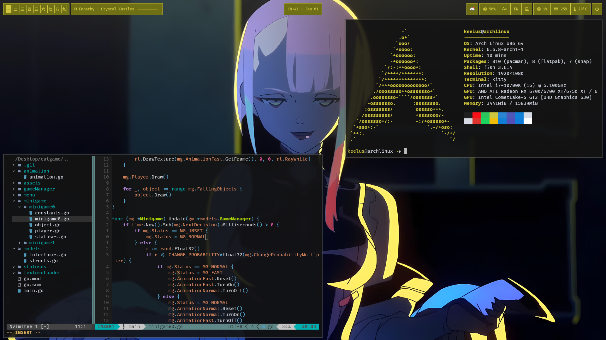

# keelus' DOTFILES
> Repo is WIP

## Information
- OS: Arch Linux
- WM: [Hyprland](https://hyprland.org/)
- Top bar: [Waybar](https://github.com/Alexays/Waybar)
- Text editor: Neovim
  - Theme: PaperColor 
- Terminal: [Kitty](https://sw.kovidgoyal.net/kitty/)
  - Theme: Brogrammer
  - Font: Fira Code Mono
- Shell: [Fish](https://fishshell.com/)
- File explorer: Dolphin
- App launcher: [Fuzzel](https://codeberg.org/dnkl/fuzzel)
- Greeter: [greetd](https://wiki.archlinux.org/title/Greetd), [tuigreet](https://github.com/apognu/tuigreet)
- Virtual terminal color scheme: base16-twilight.hex (use [base16-vtrgb](https://github.com/coderonline/base16-vtrgb))
- Screenshot tool: [swappy](https://github.com/jtheoof/swappy) (with [grim](https://sr.ht/~emersion/grim/))
- Fonts: Fira Code Mono, Noto Sans CJK JP
- Audio: [Pipewire](https://wiki.archlinux.org/title/PipeWire) & [pavucontrol](https://archlinux.org/packages/extra/x86_64/pavucontrol/)

## Preview

